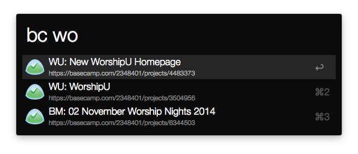

# Alfred 2 Basecamp Workflow 

Provides easy access to Basecamp Projects inside Alfred 2 (plus caching!).

## Getting Started

Download this [bad boy](https://github.com/johnthepink/alfred2-basecamp/raw/master/alfred2-basecamp.alfredworkflow), and open to install. Then:

1. Right click on the “bc” Script Filter and click “Configure”.
2. Fill out your Basecamp information. Note that if you belong to more than one organization, you can enter them separated by commas. Organization ids can be found in the Basecamp URL: https://basecamp.com/xxxxxxx. The x’s are the ID you want. Each organization has it’s own id.
3. Have fun.

This will cache your results, so if you need to refresh start your query with: !

## Contributing

1. Fork this repository.
2. Run `rake install` to symlink the directory in to Alfred.
3. Run `rake bundle:install` to bundle any gems locally.
4. Add your feature.
5. Pull requests welcome! :)
